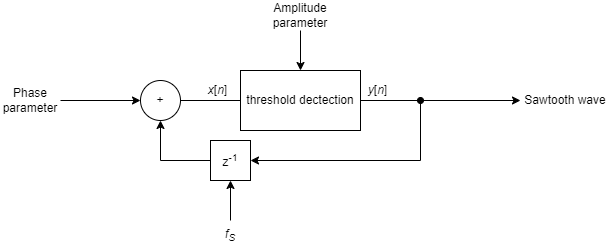

<!---

This file is used to generate your project datasheet. Please fill in the information below and delete any unused
sections.

You can also include images in this folder and reference them in the markdown. Each image must be less than
512 kb in size, and the combined size of all images must be less than 1 MB.
-->

## How it works
The Wave Generator is a project that deals with the generation of various signals. These signals are a sine function, a triangle function, a sawtooth function and a square pulse function. The desired function, which then provides the output value, can be selected using simple control signals. 

Each calculated value is generated as a 2's complement in the fixed point system Q7 and then output accordingly either via the parallel or the serial interface. An SPI interface is used for the serial output, but this can only write and not read. However, this makes it possible to connect a DAC to the wave generator in order to convert the digital signals into analogue signals. 

In general, the implemented signals can be influenced by three parameters: 

- due to the internal clock frequency $f_{clk}$
- by the phase parameter
- by the amplitude parameter

These three parameters allow these signals to be flexibly configured in terms of their respective properties. Depending on the type of signal, however, certain restrictions must be taken into account for the parameters. These restrictions are then described in the respective section for the corresponding signal.  

In addition, the sampling frequency $f_{s}$ is linked to the internal clock frequency $f_{clk}$ of the system by a factor of 40. A value therefore requires 40 clock pulses to be calculated and output via the serial interface. This results in the following relationship: $f_s = \frac{f_{clk}}{40}$. The maximum internal clock frequency $f_{clk}$ is $66 \text{\;MHz}$ and therefore the maximum sampling frequency $f_{s}$ is $1.65 \text{\;MHz}$.

### Inputs and outputs
The Wave Generator uses all 24 digital pins. The input pins are described in the pinout section. These 8 input pins add up to the bit vector parameter. This is required to set the phase and amplitude, as the respective value is applied to it as a 2's complement in the fixed-point system Q7. The bidirectional pins "set phase" and "set amplitude" are used to adopt this value as the phase value or amplitude value in the chip. 

The current value is output in parallel form on the output wave pins and in serial form on the SPI pins. The SPI pins have the same names as defined in the standard, with the exception that the input pin MISO is missing. This is not required due to the pure data generation.

The bit vector wavefrom (see pinout section) is used to select the desired function. The desired function then results depending on the bit pattern:

- 00: Sine wave 
- 01: Square puls wave
- 10: Sawtooth wave
- 11: Triangular wave

The value generation can be stopped by the pin enable (see pinout section) with a LOW level and continued with a HIGH level.

### Sine wave
The sine wave is generated using a Cordic algorithm, as shown in figure \ref{fig:block_sin}. This Cordic algorithm is used in the mode rotation and with the coordinate system circular. The following function is implemented in the Cordic algorithm:
$$x_n = x_0 \cos(z_0) - y_0 \sin(z_0)\\y_n = y_0 \cos(z_0) + x_0 \sin(z_0)$$
To generate a sine wave from this formula, $y_0$ must be set to 0 and $x_0$ must be loaded with the desired amplitude. The current phase $z_0$ of the sine wave is calculated in advance by a phase accumulator. This then transfers its current phase value to the Z input of the Cordic algorithm. This allows the Cordic algorithm to generate a sine wave at the Y output, which is then subsequently output.

Due to a property of the Cordic algorithm, the amplitude parameter must be scaled by a factor $k$ before loading into the chip. This factor $k$ has a value of $0.6073$. This prevents an overflow in the Q7 format and the correct values are calculated by the algorithm.

This results in the following formulae for the parameters:
$$ \text{Amplitude parameter} = k A \\ \text{Phase parameter} = \frac{2f}{f_s}$$
Where $A \in [-1+2^{-7}, 1-2^{-7}]$ is the desired amplitude and $f \in (0, \frac{f_s}{2}]$ is the desired frequency.

## How to test

To test you have to do following

## External hardware

List external hardware used in your project (e.g. PMOD, LED display, etc), if any
